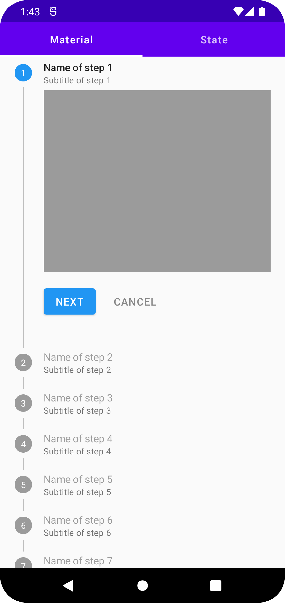

<h1 align="center">Stepper Material with Compose</h1>

  

  
Stepper Compose is a Composable UI library based on <a href="https://developer.android.com/jetpack/compose">Jetpack Compose</a> and designed following <a href="https://material.io/archive/guidelines/components/steppers.html">Material Guidelines</a>.

 

 

## Tech stack & Open-source libraries
- Minimum SDK level 21
- [Kotlin](https://kotlinlang.org/) 1.6.10
- [Compose UI](https://mvnrepository.com/artifact/androidx.compose.ui/ui/1.1.1) 1.1.1
- [Compose Runtime](https://mvnrepository.com/artifact/androidx.compose.runtime/runtime/1.1.1) 1.1.1
- [Compose Material](https://mvnrepository.com/artifact/androidx.compose.material/material/1.1.1) 1.1.1
- [Compose Icons Extended](https://mvnrepository.com/artifact/androidx.compose.material/material-icons-extended/1.1.1) 1.1.1
- [ConstraintLayout Compose](https://mvnrepository.com/artifact/androidx.constraintlayout/constraintlayout-compose/1.0.0) 1.0.0
- [com.google.android.material:material](https://mvnrepository.com/artifact/com.google.android.material/material/1.5.0) 1.5.0